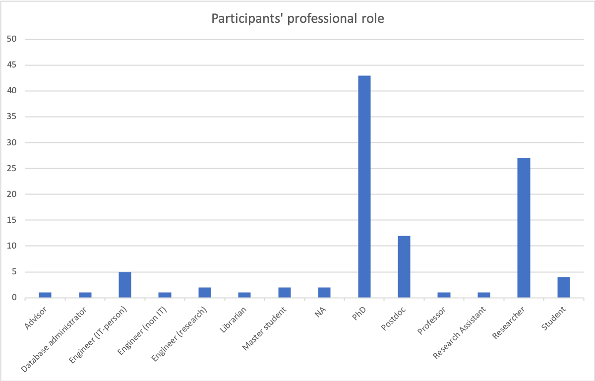
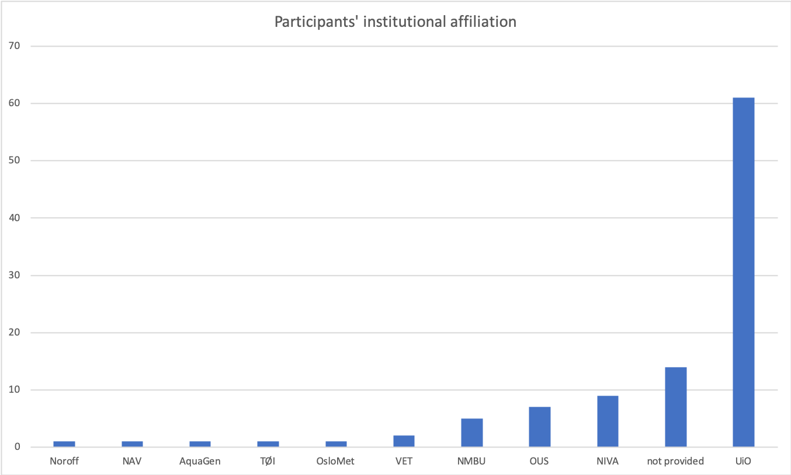
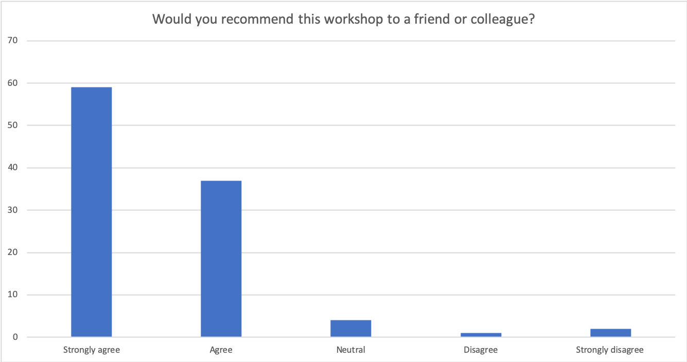
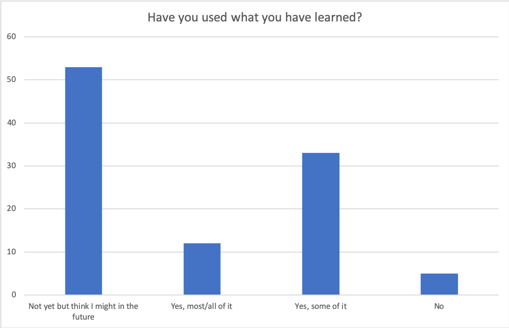
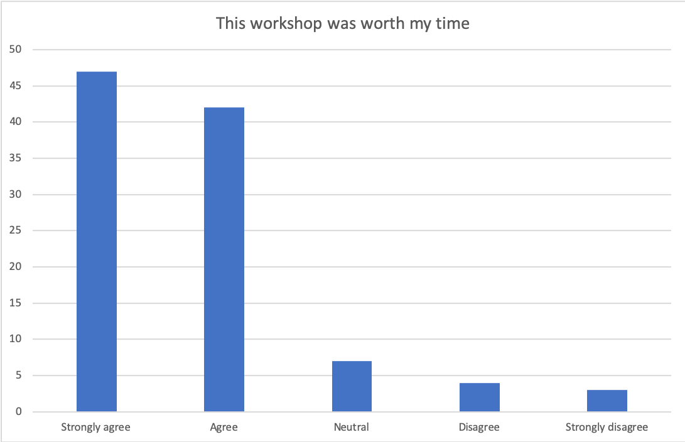
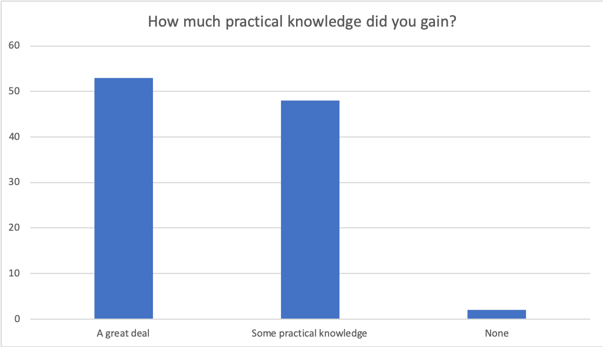

# Carpentries-Workshops 2019 -- Summary Of Learners' Feedback

## Data and Data Analysis

After every workshop taught by Carpentry@UiO, a post-workshop feedback survey is sent out to participants, circa one-two weeks after the workshop. The responses are collected in Nettskjema. For this report, I have downloaded the data from the main Nettkjema survey as well as the data from two survey forms that were created for the GitHub workshop in September 2019 and the Databases and SQL workshop in October 2019. The questions in all survey forms were identical.

After downloading the survey data (tabular data) as an Excel spreadsheet, I have combined the data from all three spreadsheets into one single spreadsheet. Due to the nature of some of the questions, the values in the columns "Professional Role" and "Institutional Affiliation" vary greatly. I have normalised the values for both columns manually. I.e. the different spelling variations of "University of Oslo" have been normalised to "UiO", while all departmental affiliations were omitted, since they were not stated in more than 50% of responses. For the values in "Professional Role" I have looked at the free text option for "Other" and normalised the responses to either fit the pre-set values (e.g. "researcher", "PhD", "PostDoc") or made the role more explicit (e.g. "database administrator").

For the simple analyses, I have used the Pivot-table function in MS Excel and created bar charts.

The original data (anonymised) is stored on a UiO G-Suite directory and can be accessed upon request.

## Workshops

### Workshops We Taught

* Python (novices) - Feb 8, 2019
* Intro to Git (novices) - Feb 15, 2019
* Git in Practice (intermediate) - Feb 27, 2019
* Data Analysis and Visualisation in R for Ecologists - Mar 8, 2019
* Unix Shell (novices) - Apr 24, 2019
* Data Analysis and Visualisation in R for Ecologists - May 15, 2019
* Introduction to R with Tidyverse (pt. 1) - May 22, 2019
* Introduction to R with Tidyverse (pt. 2) - May 29, 2019
* Getting your hands on climate data (novices) - Jun 7, 2019
* Writing and Publishing Together on the Web Using GitHub (novices) - Sep 11, 2019
* Plotting and Programming with Python (novices) - Sep 16, 2019
* Databases and SQL - Oct 28, 2019
* R for Reproducible Scientific Analysis (novices) - Nov 19, 2019

**Carpentries @ UiO was also involved in the ResearchBazaar 2019**

-   Two-day  [Learn Deep-Learning with Python](https://www.ub.uio.no/english/courses-events/events/all-libraries/2019/research-bazaar/190109_DeepLearning.html)
-   One-day  [Get (even) smarter with the Unix Shell](https://www.ub.uio.no/english/courses-events/events/all-libraries/2019/research-bazaar/190109_UnixShell.html)
-   Half-day  [Publication Ready Scientific Reports with Jupyter Notebook](https://www.ub.uio.no/english/courses-events/events/all-libraries/2019/research-bazaar/190110_Jupyter.html)
-   Half-day  [Getting Started with Open Science Framework](https://www.ub.uio.no/english/courses-events/events/all-libraries/2019/research-bazaar/190110_OpenScienceFramework.html)

*The workshop and course registry on the Carpentry@UiO website is continuously updated [https://uio-carpentry.github.io/](https://uio-carpentry.github.io/)*
*The [course catalogue of Carpentry workshops taught at UiO](https://www.ub.uio.no/english/courses-events/courses/other/Carpentry/CarpentryWorkshops/) is keeping a backlog ("Previous"), too*

### Utilisation

We had booked rooms for 34 full-day workshops, we held 13 workshops and two on-boarding sessions (both on the same day).

## Feedback From Our Learners

We got feedback for 10 workshops from 103 participants.

### Who Are Our Learners?

### Which Institutions Are Our Learners Affiliated With?

### Are We Reaching Our Goals With Software Carpentry?

### Would You Recommend This Workshop To A Friend Or Colleague?

### Have You, After The Course, Used What You Learned?

### Was This Workshop Worth My Time?

### How Much Practical Knowledge Did You Gain From The Workshop?

### Should We Have Other And More Workshops at UiO? - What Workshop or Topics Are Our Learners Missing?

Most participants' request that we offer more - and different - workshops.

The main request is for courses that built on the Python and R for novices workshops.

There is a strong need expressed for more advanced R, especially in combination with statistical methods. This is perhaps something that other units at UiO, e.g. USIT, as well as the individual departments can address.

Some participants ask for more workshops for Unix Shell / Bash and Git.

There are more requests for machine learning workshops.

In addition, participants request workshops for research data management, workflow management, unit tests, data preparation and cleaning, information security, GitHub, Internet of Things (IoT), programming with Fortran and Julia, and GIS.

There is a significant amount of participants requesting data visualisation workshops.

At this point, it is difficult for the Carpentry@UiO community to meet the requests that go beyond the lessons that The Carpentries offer, e.g. statistics, machine learning, other programming languages than Python and R, information security, IoT etc. Perhaps, some of these requests could be met by CodeRefinery workshops (e.g. the "advanced" versions of Carpentry lessons). Another course of action could be to share the more specific requests of some participants with USIT which has resources to offer tailored workshops and courses beyond Carpentry. Tapping into our Carpentry@UiO members' knowledge and expertise might, in addition, prove useful in developing new workshops - or episodes to existing workshops - that meet our participants' needs.

As a general take-away for the workshop planning for spring 2020 should not only the number of workshops on Python and R for novices be increased, but also complementary workshops on both Python and R be offered to our learners. This issue has been considered in the workshop planning.

### Comments and Constructive Criticism

Comments usually are generous and positive feedback. Some participants point out the lack of enough helpers, or comment on speed, previous knowledge, level of the workshop etc. A more frequent comment is that people get stuck and fall behind - and do not ask the helpers or instructors. This should be anticipated and accommodated for with more – and shorter – breaks. Another issue is the delay in the beginning of some workshops. This has been reduced significantly (anecdotal evidence) by explicitly stating in the course description on the uio.no course catalogue that participants need to come prepared in order to participate.
